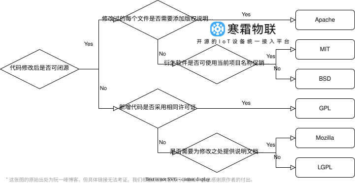

> [!CAUTION]
> 🚧 寒霜物联项目目前尚处于开发阶段，暂未完成开发，请过段时间再来看吧

<div align="center">

<p>
    
</p>

# 寒霜物联 Frost IoT

支持轻量化快速接入的 IoT 设备统一接入平台

<!-- https://shields.io/badges/static-badge -->
[](https://opensource.org/license/BSD-3-Clause) 

[](https://github.com/footprintcat/frost-iot/commits/) 
</div>

## 项目简介

不做花里胡哨的 UI 界面，专注设备接入底层逻辑，为企业数字化转型提供底层支持。

### 目录说明

运行 `gradlew projects` 查看项目结构

<!--
```
<root>
  |- common: Common 包
  |- design: 设计素材
```
-->

## ⭐ Star History

[](https://www.star-history.com/#footprintcat/frost-iot&Date)

### 许可证

[BSD-3-Clause license](LICENSE)



### 镜像同步仓库

用户可以在访问 GitHub 遇到困难时，使用我们的 Gitee 官方仓库：[gitee.com/footprintcat/frost-iot](https://gitee.com/footprintcat/frost-iot)

**另外也麻烦在 Gitee 上 Star 了本项目的用户，尽量同步 Star 一下 [GitHub 仓库](https://github.com/footprintcat/frost-iot)，谢谢！**
